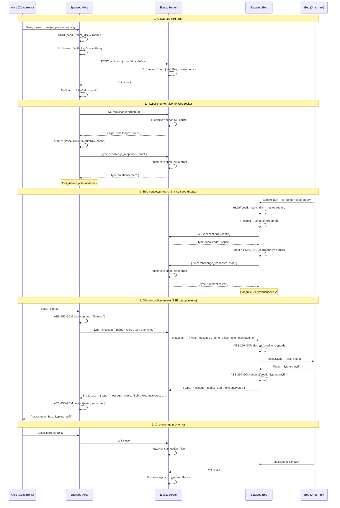

# b_chat

Приватный мессенджер с end-to-end шифрованием. Комнаты создаются из seed-фразы — никакой регистрации, сервер никогда не видит открытый текст.

## Стек

- **Backend:** Bun + Elysia + WebSocket
- **Frontend:** Preact + Preact Signals + Tailwind/DaisyUI
- **Криптография:** HKDF (SHA-256), HMAC-SHA256, AES-256-GCM, BIP39

## Как это работает

